# .NET 6.0 Portföy Projesi

M&Y Akademi Danışmanlık bünyesinde, eğitmenim Murat Yücedağ rehberliğinde .NET 6.0 kullanılarak geliştirdiğim portföy uygulamasını sizlere tanıtmaktan mutluluk duyuyorum! Bu proje, hem teknik becerilerimi pekiştirmek hem de dinamik içeriklerle kullanıcı dostu bir web uygulaması oluşturmak amacıyla hayata geçirilmiştir.

---

## 📋 Proje Yapısı

Proje iki ana bölümden oluşmaktadır:

### 💊 Kullanıcı Arayüzü (UI) Bölümü
Kullanıcıların projeleri, deneyimleri ve diğer içerikleri görüntüleyebileceği, estetik ve kullanıcı dostu bir arayüzdür. Sayfalar dinamik olarak veri tabanından çekilir ve kullanıcı deneyimi ön planda tutulur.

### 💊 Admin Paneli
Yönetici, bu panel üzerinden UI kısmındaki içerikleri kolaylıkla yönetebilir. Admin panelinde toplam 9 farklı içerik yönetim modülü bulunmaktadır ve her biri için CRUD (Create, Read, Update, Delete) işlemleri yapılabilir.

---

## 🧑‍💻 Admin Paneli Özellikleri

Admin paneli sayesinde, kullanıcılar portföylerinin tüm içeriklerini yönetebilir. İşte yönetilebilen alanlar:

- **Hakkımda**: Kullanıcı kendisini tanıttığı bu bölümü güncelleyebilir.
- **Yeteneklerim**: Kullanıcı teknik ve kişisel yeteneklerini ekleyip düzenleyebilir.
  
  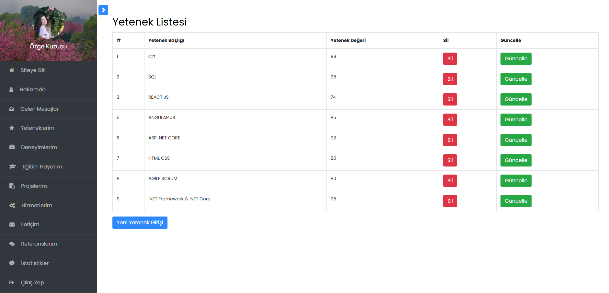
  
- **Deneyimlerim**: Kullanıcı iş veya proje deneyimlerini yönetebilir. Yeni deneyimler eklenebilir, mevcut deneyimler düzenlenebilir veya silinebilir.
  
  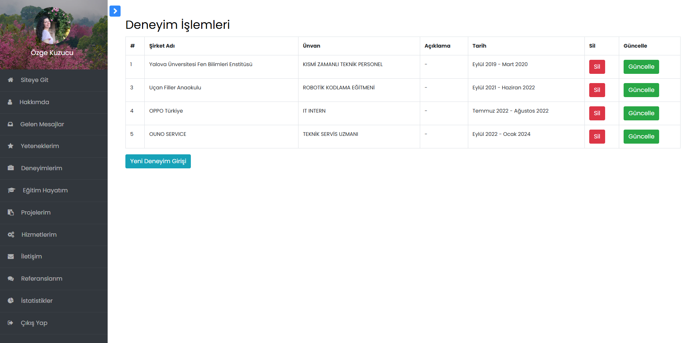
  
- **Eğitim Hayatım**: Kullanıcı aldığı eğitim bilgisini yönetebilir.
  
   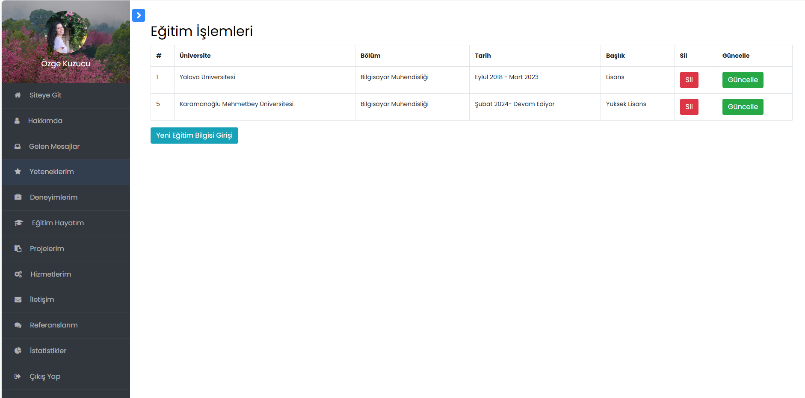
  
- **Projelerim**: Kullanıcı, tamamladığı projeleri ekleyebilir, düzenleyebilir veya silebilir.
  
   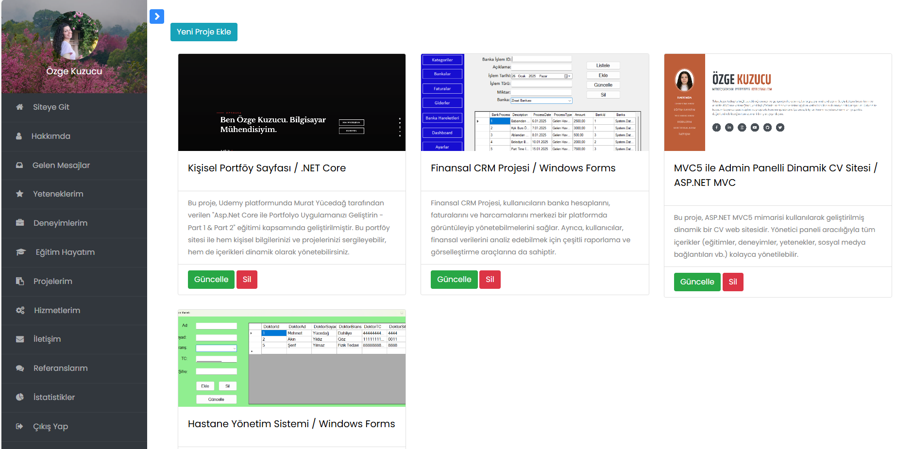
   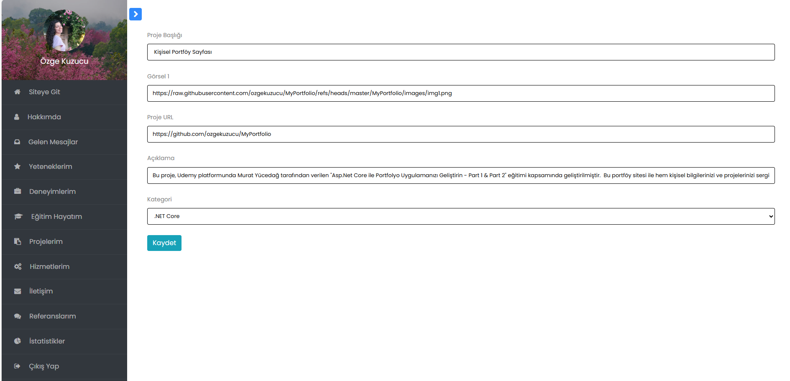
  
- **Hizmetlerim**: Kullanıcı verdiği hizmetleri ekleyip düzenleyebilir.
  
   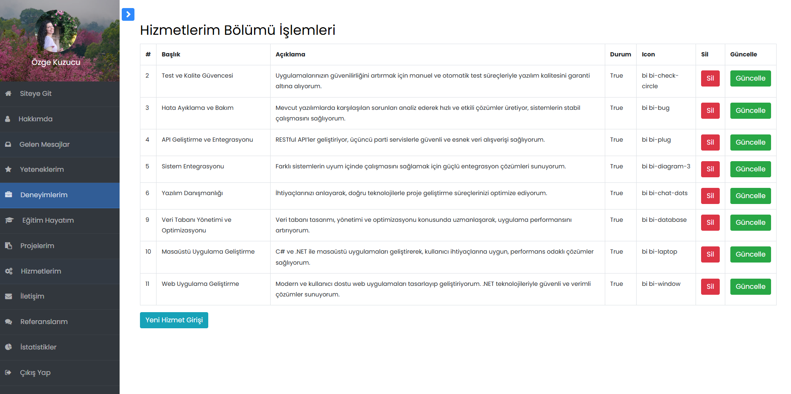
   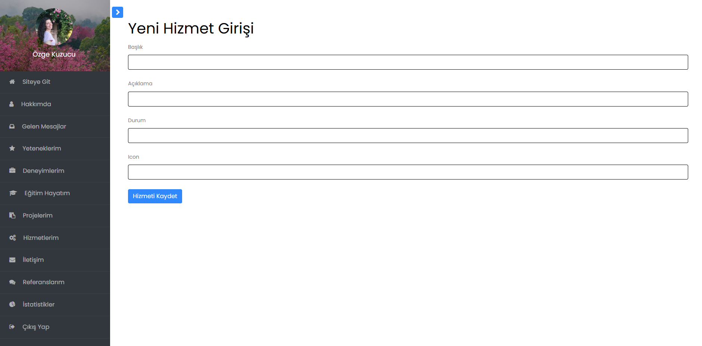
  
- **Referanslarım**: İş veya eğitim hayatında referans gösterilen kişilerin bilgileri yönetilebilir.
  
   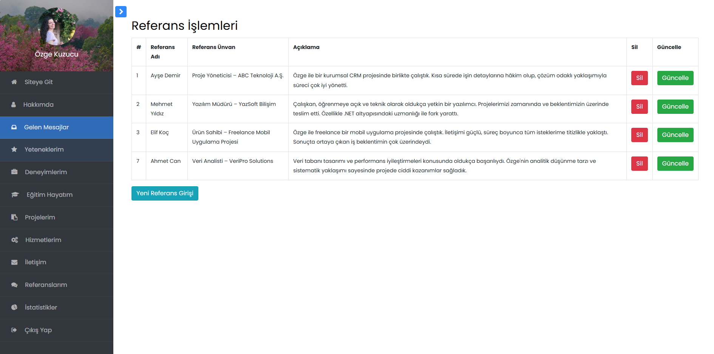
  
- **İletişim Bilgileri**: İletişim bilgileri üzerinde yönetim yapılabilir.
  
   
  
- **İstatistikler**: Portföydeki tamamlanan projeler, gelen mesajlar, deneyimlerle vb. ile ilgili istatistiksel veriler yönetilebilir.
  
   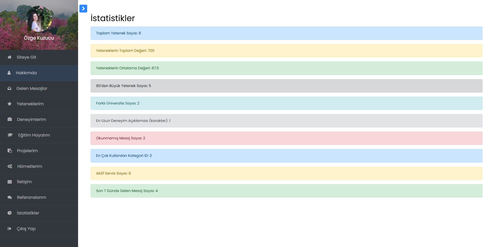
  
- **Gelen Mesajlar**: Kullanıcıya gelen mesajlar okunabilir, silinebilir ve durumları güncellenebilir.
  
   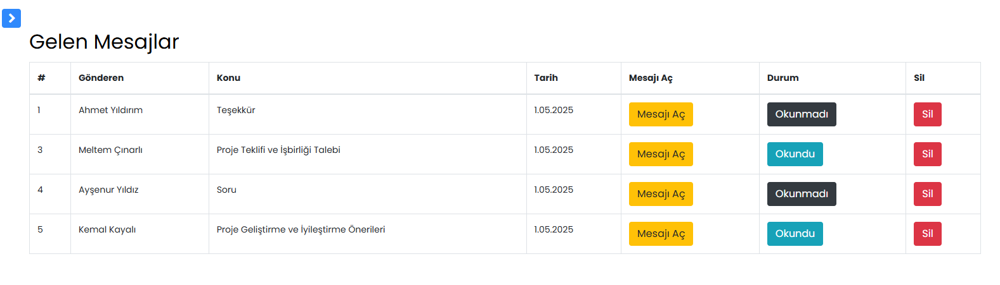
   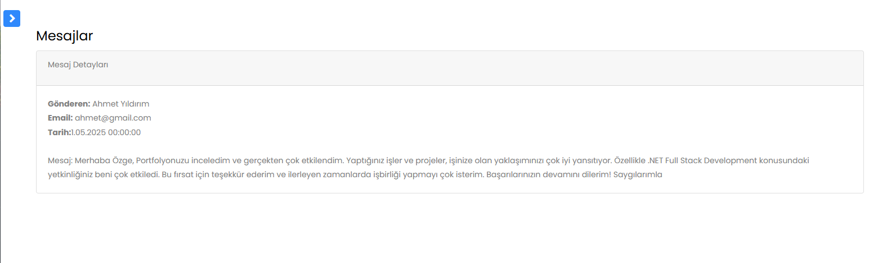
  
---

## 💻 UI Paneli Özellikleri

UI kısmı, veri tabanından dinamik olarak veri çekerek kullanıcıya sürekli güncel içerik sunar. İşte bazı özellikler:

- **Öne Çıkanlar**: Tüm veriler veri tabanından dinamik olarak çekilir.
  
   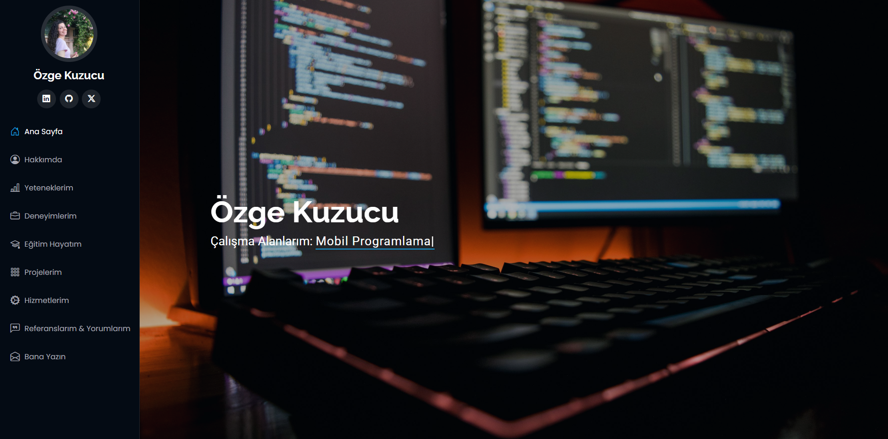
  
- **Hakkımda**: Kullanıcının kişisel tanıtımı dinamik bir şekilde veri tabanından alınır.
  
   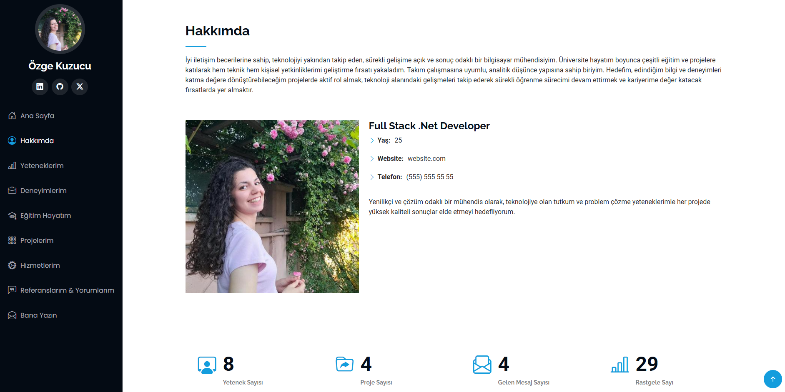
  
- **Yeteneklerim**: Teknik ve kişisel becerilerin listelendiği, puan veya seviye gösterimi ile zenginleştirilmiş dinamik bir bölümdür.
  
    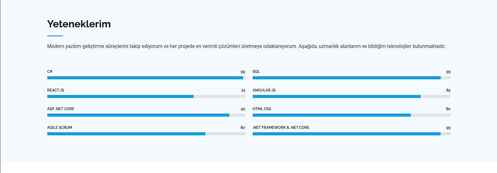
  
- **Deneyimlerim**: İş ve proje tecrübeleri kullanıcıya sunulur.

    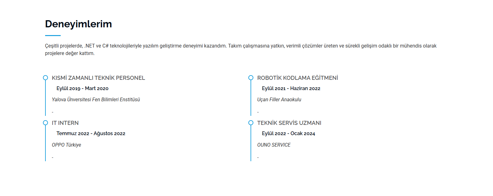

- **Eğitim Hayatım**: Kullanıcının mezuniyetleri, aldığı eğitim programları ve sertifikaları içerir.
  
    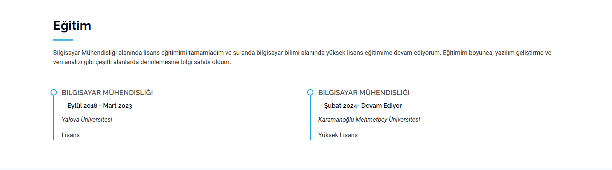
  
- **Projelerim**: Kategorilere ayrılmış projeler, dinamik bir yapıda gösterilir.

    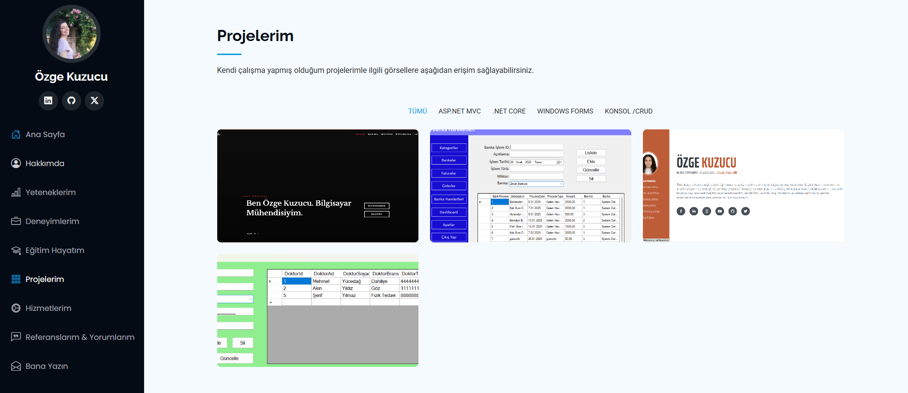
  
- **Hizmetlerim**: Kullanıcının sunduğu profesyonel hizmetlerin tanıtıldığı bölümdür.

    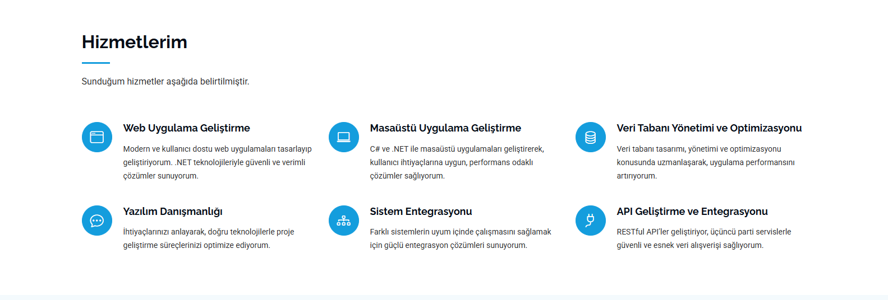
  
- **Referanslarım ve Yorumlarım**: Kullanıcının birlikte çalıştığı kişilerden alınan yorum ve referanslar yer alır.

    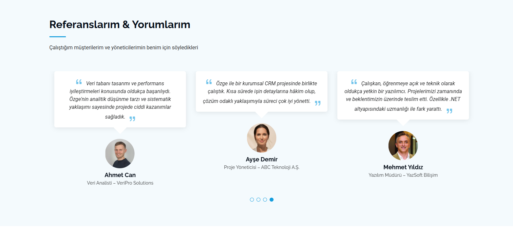
  
- **İletişim Bilgilerim**: Kullanıcı iletişim bilgilerini görüntüleyebilir ve mesaj gönderebilir.
  
- **Bana Yazın**: Ziyaretçilerin kullanıcıya doğrudan mesaj gönderebildiği, iletişimi kolaylaştıran bir form alanıdır.

   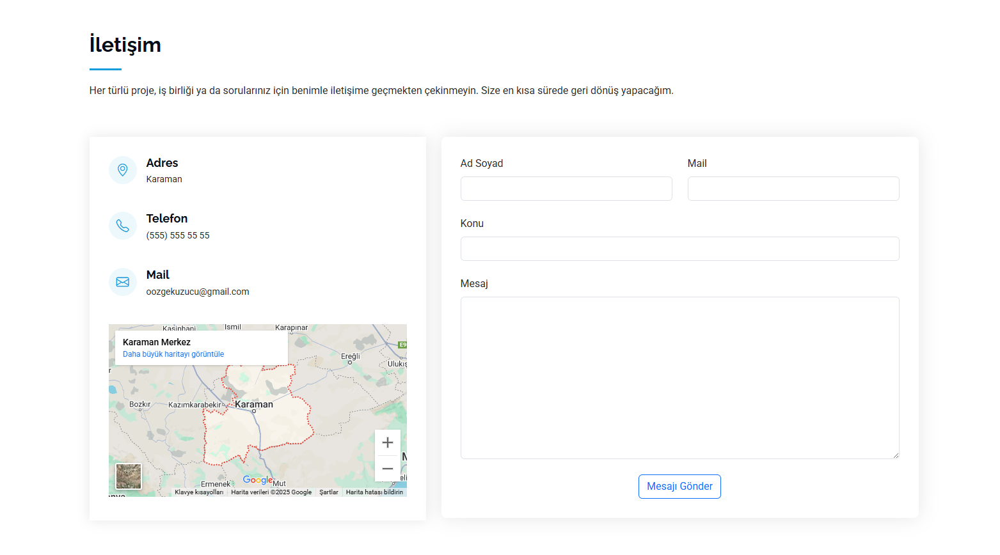
---

## 📍 Harita ve Footer

Google Maps API kullanılarak kullanıcıların konum bilgisi harita üzerinde gösterilebilir. Lokasyon bilgisi veri tabanından dinamik olarak alınır.

## 🚀 Kullanılan Teknolojiler

- **ASP.NET Core 6.0**: Proje altyapısında dinamik ve sürdürülebilir bir yapı oluşturmak için bu modern framework kullanılmıştır.
- **PartialView**: UI sayfalarını parçalara ayırarak daha düzenli ve yönetilebilir bir yapı oluşturulmuştur.
- **Entity Framework Core (Code First)**: MSSQL veritabanı ile iletişimi sağlayan Code First yaklaşımı kullanılmıştır.
- **ViewComponent**: Sayfa bileşenlerini daha işlevsel hale getirmek ve veri çekimini yönetebilmek için kullanılmıştır.
- **Tek Katmanlı Mimari**: Proje, basit ve anlaşılır bir yapı oluşturmak için tek katmanlı mimari ile geliştirilmiştir.

